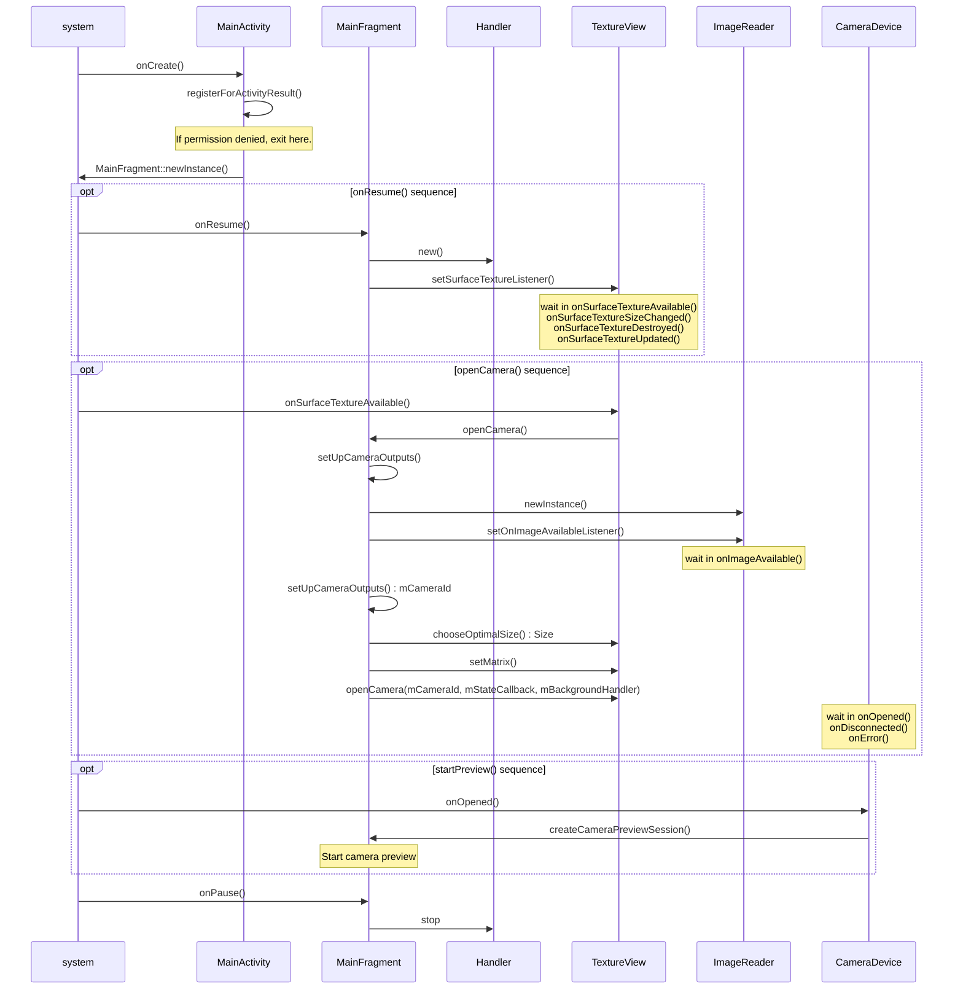

# And-OneShotCamera
単射専用カメラのサンプル 

Androidサンプルの[Camera2Basic](https://github.com/googlearchive/android-Camera2Basic.git)と内容はほぼ同じ。 
ビルドが通らんかったから、再作成した。

αバージョン ... まだ、開発中。

# And-OneShotCamera
One shot only camera sample code. 

The content is almost the same as the Android sample [Camera2Basic](https://github.com/googlearchive/android-Camera2Basic.git).  
The build didn't work, so I recreated it.

Alpha version ... still under development.

# Camera2使用のシーケンス
# Sequence using camera2

作るときに StackEdit – In-browser Markdown editor などを使うと WYSIWYG でいい感じです。
https://qiita.com/takke/items/86a5ddf145cf9693b6e9

markdownでシーケンス図を書こう
https://qiita.com/konitech913/items/90f91687cfe7ece50020
